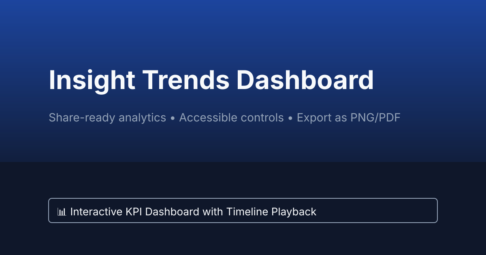

# Insight Trends Dashboard

A responsive, accessibility-first analytics dashboard that visualizes KPI trends, supports keyboard-driven timeline playback, and offers export tooling to generate share-ready PNG/PDF snapshots.



## ✨ Features

- **Visualization Exports** – Save the live chart area as PNG or PDF using `html-to-image` and `jsPDF`.
- **Keyboard Timeline Controls** – Play/pause the animated timeline with <kbd>Space</kbd> and scrub using arrow keys.
- **Accessible UI** – ARIA labels, status regions, skip links, and focus indicators for assistive technologies.
- **Configurable Data** – Pull updates from Google Sheets or fall back to bundled demo data.
- **SEO Ready** – Favicon, meta tags, and Open Graph/Twitter cards for richer sharing previews.

## 🧱 Project Structure

```
├── assets
│   ├── css
│   │   └── style.css          # Global styles and layout tokens
│   ├── js
│   │   ├── dashboard.js       # Timeline controls, chart rendering, exports
│   │   ├── dataFormatter.js   # Google Sheets parsing & normalization helpers
│   │   └── dataFormatter.test.js
│   └── images
│       └── social-share.svg   # Open Graph social preview asset
├── _layouts
│   └── default.html           # Custom Jekyll layout with SEO/meta tags
├── index.md                   # Dashboard content and accessibility markup
├── package.json               # Scripts for linting, testing, and builds
├── jest.config.js             # Jest configuration (JS + DOM testing)
├── babel.config.js            # Babel config for Jest
├── .eslintrc.json             # ESLint configuration (Airbnb + Prettier)
├── .prettierrc.json           # Prettier preferences
├── .env.sample                # Environment variable template
└── README.md
```

## 🚀 Getting Started

### Requirements

- Node.js 18+
- npm 9+
- Ruby 3.1+ with Bundler (for local Jekyll builds)

### Installation

```bash
# Clone
git clone https://github.com/AgabaSteven/coding-my-first-web.git
cd coding-my-first-web

# Install node tooling
npm install

# (Optional) Install Jekyll dependencies
bundle install
```

### Environment

Duplicate `.env.sample` to `.env` and populate:

```
cp .env.sample .env
```

- `GOOGLE_SHEETS_URL` – Published CSV URL or Sheets API JSON endpoint.
- `GOOGLE_SHEETS_RANGE` – Optional Sheets API range override (defaults to `Dashboard!A1:E20`).
- `JEKYLL_ENV` – Defaults to `production` for CI builds.

> **Tip:** For a quick data feed, publish your sheet (“File → Share → Publish to web”) or leverage the Sheets API with an API key.

### Local Development

```bash
# Lint and test
npm run lint
npm test

# Run Jekyll locally with live reload
env $(cat .env 2>/dev/null | xargs) npm start
```

### Build

```bash
npm run build
```

This task runs linting, unit tests, and `bundle exec jekyll build` to output the static site in `_site/`.

## ☁️ Deployment

### Common Settings

| Platform | Build Command         | Output Dir | Environment Variables |
| -------- | --------------------- | ---------- | --------------------- |
| Vercel   | `npm run build`       | `_site`    | `GOOGLE_SHEETS_URL`, `GOOGLE_SHEETS_RANGE`, `JEKYLL_ENV=production` |
| Netlify  | `npm run build`       | `_site`    | same as above         |

#### Vercel Steps

1. Import the repo at [vercel.com/new](https://vercel.com/new).
2. Add environment variables (Settings → Environment Variables).
3. Override the Build Command and Output Directory as shown above.
4. Deploy. Every push triggers a fresh build.

#### Netlify Steps

1. Create a new site from Git in the Netlify dashboard.
2. Configure build settings (`npm run build` / `_site`).
3. Define environment variables under Site Settings → Build & deploy → Environment.
4. Deploy or trigger builds via the Netlify CLI (`netlify deploy --build`).

### Google Sheets Checklist

1. Structure headers: `Period`, `Active Users`, `Conversion Rate`, `Retention Rate`, `NPS`.
2. Publish the sheet or create an API key with Sheets API access.
3. Set `GOOGLE_SHEETS_URL` to either a CSV export URL or the v4 Sheets API endpoint:

```
https://sheets.googleapis.com/v4/spreadsheets/YOUR_SHEET_ID/values/Dashboard!A1:E20?key=YOUR_API_KEY
```

4. Optional: set `GOOGLE_SHEETS_RANGE` to customise the range.
5. Deploy — the dashboard automatically fetches and formats the sheet when available.

## 🔍 Quality Gates

- `npm run lint` – ESLint (Airbnb + Prettier).
- `npm test` – Jest unit tests for the data formatter utilities.
- `npm run format` – Prettier formatting helper.
- CI should execute lint + test to guard PRs from regressions.

## ♿ Accessibility Highlights

- Semantic regions with ARIA labels for timeline, keyboard tips, and status updates.
- `aria-live` regions announce timeline period changes and export status.
- Skip link, high-contrast colour palette, and focus outlines for keyboard users.
- Keyboard shortcuts (<kbd>Space</kbd>, <kbd>←</kbd>, <kbd>→</kbd>) with matching tooltips.

## 🎨 Framer Components

This repository also includes a production-ready **Product3DViewer** component for Framer. While the main project serves as a Jekyll-based analytics dashboard, the Framer component provides an independent 3D product visualization experience with configurable camera, lighting, and material controls.

### Quick Start

- **Documentation**: See [`framer/README.md`](framer/README.md) for full setup, Framer import instructions, property control reference, and example configurations.
- **Prerequisites**: Node.js 18+, npm 9+, and a Framer account (Starter plan or higher recommended).
- **Integration**: The Framer component and Jekyll dashboard coexist in this repository but are deployed separately. The dashboard builds with `npm run build` and outputs to `_site/`, while the Framer component is imported into Framer projects via GitHub integration.

The Framer component does not require Ruby or Jekyll to function. If you only need the 3D viewer, install the JavaScript tooling with `npm install` and follow the [import workflow](framer/README.md#importing-into-framer) to bring the component into your Framer canvas.

## 📄 License

MIT © Insight Engineering Team
